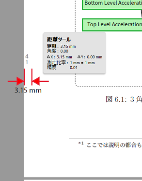

## これは何？

このリポジトリは技術同人誌作成時に使うコンテナを生成するためのものです。
現在以下の機能を持っています。

- 印刷所入稿のための隠しノンブルの追加 (日光企画向け)
- 印刷所入稿のためのフォントの埋め込み
    - Helvetica フォントの埋め込みが主な役割です
- 電子版作成のための補助機能
    - 本文と、表紙表・裏の画像を結合して、電子版を生成

## 動作確認環境

- Windows10
- Docker Desktop for Windows
    - WSL2 backend 有効

## 使用方法

作業中のデータが "C:\mybook" にあると想定します。
これの代わりに環境変数 `%CD%` を用いて、カレントディレクトリで操作するのもよいでしょう。

### 隠しノンブルの追加

隠しノンブルの追加およびフォントの埋め込みを行うコマンドは以下のとおりです。

```
docker run -v C:\mybook:/doc techlabxe/preprintproc submission input.pdf output.pdf
```



### 電子版作成

電子版の作成コマンドは次のとおりです。

```
docker run -v C:\mybook:/doc techlabxe/preprintproc ebook front.png body.pdf back.png output.pdf
```

詳しい説明などは、ブログの方にも記載しています。

- https://blog.techlab-xe.net/tbf-printpreproc-container/

## 注意事項

作者が使う条件下でのみチェックしているため、何かしら不具合がある可能性があります。
また、本ツールは自由に利用できますが、各自の自己責任で使用して下さい。
これでデータが破損したり、入稿に失敗したりしても責任は持てません。

## 補足情報

作者がよく使う設定としては、以下の通りです。

- Re:VIEW を用いて本文を生成
    - フォントデータの大半はこれで埋め込み済
    - 用紙サイズは A5
    - トンボデータは無し (用紙ギリギリまで使用しない)
- 表紙データは PNG 形式で与える
    - 表紙データは Photoshop で作成した入稿用のデータから作成
